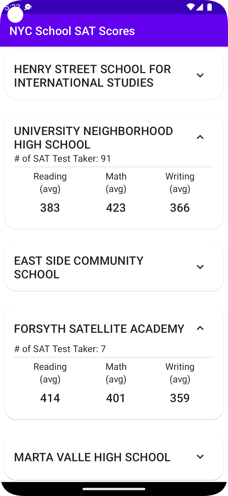
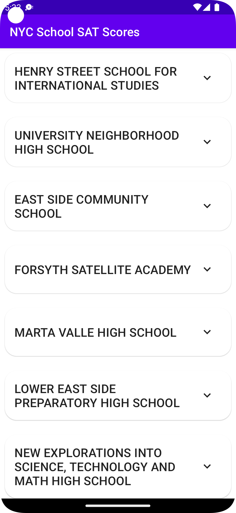
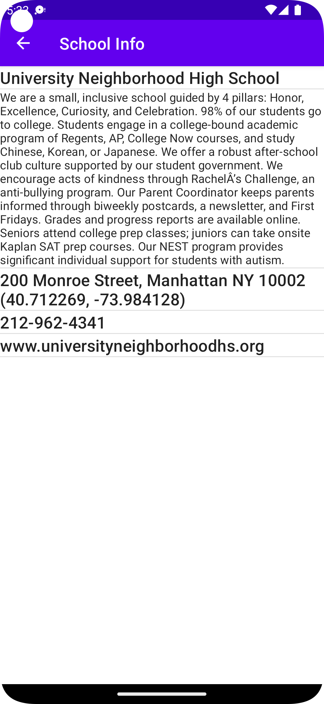

# NYCSchoolApp

 |

## Technology
Android, Jetpack Compose, Retrofit, Moshi, Room

## API

Data Source : https://opendata.cityofnewyork.us/

[List of NYC Schools](https://data.cityofnewyork.us/resource/s3k6-pzi2.json)

[NYC School SAT Scores](https://data.cityofnewyork.us/resource/f9bf-2cp4.json)
